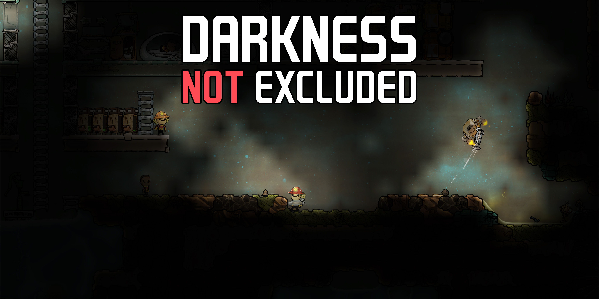

[[Steam](https://steamcommunity.com/sharedfiles/filedetails/?id=2964969010)]

Introducing **Darkness Not Excluded**—a mod that dares you to illuminate the depths of your asteroid and conquer it _with the power of light_!

---

Get ready to embrace the shadows as this mod transforms your gameplay, making light a vital element of your colony:

**Unlit Tiles**: Experience the thrill of pitch-black tiles that hide their secrets from your cursor.

**Equipment Lights**: Equip your dupes with shining hats (mining, science, rocketry) and radiant suits to guide their way.

**Dupe Glow**: Marvel at your dupes' innate dim glow as they fumble through the darkness.

**Considerate Dupes**: Dupes will be considerate and turn off their lights any time they enter a room where another dupe is sleeping.

**Stat Penalties**: Beware the reduced coordination of dupes that forgot to bring a source of light when exploring the asteroid.

**Grace Period**: Enjoy a _generous_ 3-cycle grace period to establish your luminous domain before darkness descends.

**Configurable**: Customize your adventure via the mod menu—allowing you to adjust or disable features to your liking!

---

Many ideas in this mod were borrowed from [Lights Out](https://steamcommunity.com/sharedfiles/filedetails/?id=1860377458) and [Shiny Lights](https://steamcommunity.com/sharedfiles/filedetails/?id=1949320130). Note some of its differences:

* Unlit tiles cannot be inspected (you can't see details while hovering, nor select them—though you can ask dupes to perform tasks on them)

* Suit and helmet lights cast a strong directional cone in the direction the dupe is facing, but still have a bit of glow around them
